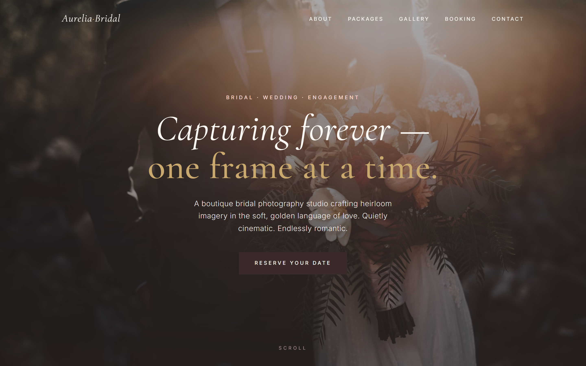

# Aurelia Bridal




## About

A single-page marketing and booking site for **Aurelia Bridal Photography** — bespoke bridal sessions, engagement shoots, and full-day wedding coverage in soft, romantic light. The whole site is one `index.html` (markup, inline `<style>`, inline `<script>`) with no build step or framework. Bookings are submitted to a [FormSubmit](https://formsubmit.co/) endpoint that emails the studio when a couple requests a session.

## File structure

```
.
├── .github/
│   └── workflows/
│       └── deploy.yml
├── .gitignore
├── CLAUDE.md
├── README.md
└── index.html
```

## How to use

```bash
git clone https://github.com/alfredang/bridebooking.git
cd bridebooking
python -m http.server 8080
```

Then open <http://localhost:8080/>.

The booking form posts JSON to a remote FormSubmit endpoint, so it needs an HTTP origin (not `file://`) to work end-to-end. For visual-only changes, opening `index.html` directly is fine.

> **Heads-up — FormSubmit first-time activation:** the very first booking POST to a new recipient address triggers a one-time confirmation email from FormSubmit. Until that link is clicked, no submissions deliver. This is expected.

## Live site

🌐 **Live site:** https://alfredang.github.io/bridebooking/
